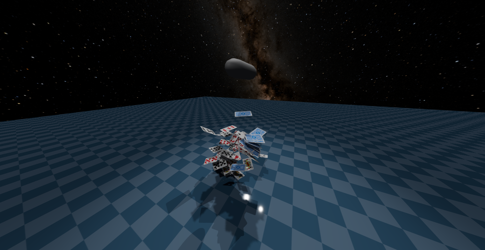

English | [简体中文](README.zh-CN.md)

# MuJoCo WASM Play: Simulate in the browser

[**Live demo (Rajagopal2015, MuJoCo 3.4.0)**](https://lshdlut.github.io/mujoco-wasm-play/dev/index.html?model=raj&forgeBase=https://cdn.jsdelivr.net/gh/lshdlut/mujoco-wasm-forge@3a963f1cd3379e10e63f6c5f5c7d6d9006aa3680/dist/3.4.0/)

## Overview

A performance-first MuJoCo viewer that brings most of the **MuJoCo Simulate** workflow to the web: open a URL and start simulating. Powered by `mujoco-wasm-forge`.

## Highlights

- **Simulate-style UI in the browser**: panels and controls closely match MuJoCo Simulate, but run anywhere a browser can run.
- **Shareable, zero-install demos**: reproducible links via URL parameters (`model=`, `forgeBase=`).
- **Performance-first runtime**: MuJoCo runs in a Worker; the built-in HUD (press `F2`) exposes CPU timing (ms/step), solver stats, FPS, memory.
- **Extensible framework**: plugins can add native-style foldable sections, panel actions, and 3D overlays without forking the viewer.

## Performance (CPU ms/step)

Reference numbers (best of 5 runs; each run reports the median; lower is better), measured interactively (rendered, not headless) with MuJoCo 3.4.0 after 35s warm-up + 8s sampling, with both side panels collapsed. CPU is the Simulate-style HUD value (press `F2`, while Running). Numbers vary with hardware, browser, and power/thermal settings.

> Important: browser extensions and site-level features (e.g. enhanced security modes / efficiency or power-saving modes) can heavily impact Worker/WASM timing, and may affect the GitHub Pages demo more than `localhost`. For fair comparisons, try a private window, disable extensions, and keep the tab in the foreground.

| Model | Native `simulate` (ms/step) | Web Play (ms/step) |
|---|---:|---:|
| `cards` | 0.542 | 0.718 |
| `humanoid` | 0.062 | 0.076 |

## Quickstart

- Local dev (serve `dev/` on port 8000):
  - `python dev/dev_server.py --root dev --port 8000`
  - `http://127.0.0.1:8000/index.html?model=raj`
- Public demo:
  - `https://lshdlut.github.io/mujoco-wasm-play/dev/index.html?model=raj&forgeBase=https://cdn.jsdelivr.net/gh/lshdlut/mujoco-wasm-forge@3a963f1cd3379e10e63f6c5f5c7d6d9006aa3680/dist/3.4.0/`
- Plugins (experimental): see `plugin_dev.md` (`smocap` coming soon).

## Models

- `model=` accepts either a `.xml` path under `dev/` or an alias: `raj`, `humanoid`, `humanoid100`, `cards`, `sensor`.

## Plugins (Experimental)

This repo can optionally load external UI/plugins without forking. Start from `plugin_dev.md` for the contract (mounts, Host API, section registry, UI kit primitives, worker constraints, and 3D overlays).

## Forge dist (required)

Forge repo: `https://github.com/lshdlut/mujoco-wasm-forge`

- This repo does not ship MuJoCo WASM binaries; it expects a forge `dist/<ver>/` bundle.
- Set the dist base via `forgeBase=` (recommended) or `window.__FORGE_DIST_BASE__`.
- Local dev default (on `localhost/127.0.0.1`) expects `/mujoco-wasm-forge/dist/<ver>/` (served automatically if you have a sibling `../mujoco-wasm-forge` checkout).
- This viewer requires a forge build with viewer extensions (scene + vopt pointers).
- Typical remote base template (jsDelivr + pinned forge commit): `https://cdn.jsdelivr.net/gh/lshdlut/mujoco-wasm-forge@<sha>/dist/{ver}/`

## Visual sources (lighting / skybox)

- `model` (default): MuJoCo-driven skybox/lights from the loaded model.
- `preset-sun` / `preset-moon`: built-in HDRI presets shipped as static assets in this repo (forge does not include HDRIs as part of `dist/<ver>/`).

## Development

- UI artifacts: `node tools/generate_ui_artifacts.mjs`
- Worker protocol artifacts: `node tools/generate_worker_protocol.mjs` (generates `dev/protocol.gen.mjs`, `dev/dispatch.gen.mjs`)
